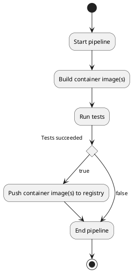

# Build artifacts

*Build artifacts* are the result of running a pipeline in our Continuous
Integration system.

We can register as many build artifacts as desired, so we can watch
them along with our results in our CI system.

However, when talking about container based microservices, it's very
common to build a container image at the beginning of the pipeline,
and use this artifact to perform a certain set of tests.

Pushing container images to a container registry does not mean
anything about **delivery** though, aside from the fact that those new
container images are sitting on our container image registry.
