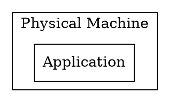
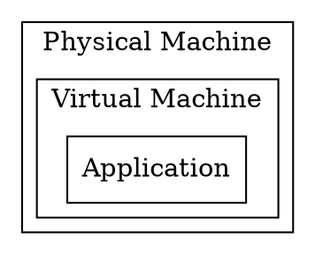
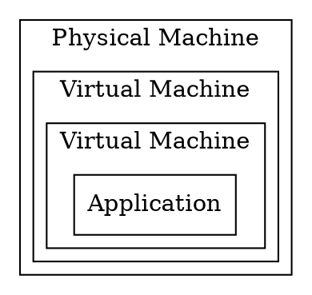
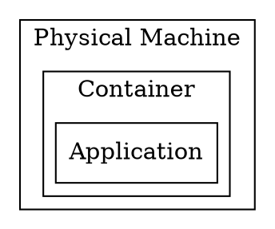
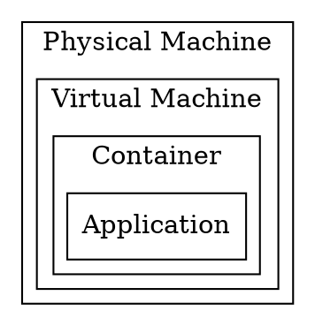

# Deployment

Once that we have created an application we want it to be consumed by
end users or other systems. We will explore what have been the
deployment options throughout time, both in terms of *infrastructure*,
and in the *techniques* used to perform those deployments.

## Infrastructure

### Metal

Deploying on the metal is the strategy of deploying an application
directly on top of the operating system that is running on a given
physical machine.

Assuming we have a physical server with an operating system running,
performing the deployment on this environment means running a number
of steps in order for the operating system to spawn a new process that
runs our server.

### Virtualization

A virtualized environment abstracts the concept of a physical machine,
running on top of a physical (or virtual) machine.

According to the
[Wikipedia](https://en.wikipedia.org/wiki/Virtualization),
*virtualization* is described as:

> *virtualization*: refers to the act of creating a virtual (rather than
> actual) version of something, including virtual computer hardware
> platforms, storage devices, and computer network resources.

When it comes to the deployment of applications, the strategy followed
for *metal* deployments can also apply on virtualized environments,
but other kind of deployments arised as well: start a machine from a
given template (or snapshot), including the application, or a mixed
approach in which certain components and pre-requisites come with the
template or snapshot, and some automation is used to deploy the
desired version of the application.

Since booting virtual machines is to all effects booting a machine
with a fully fledged operating system the startup time is still in the
orders of metal deployments.

<table>
<tr>
<td>

</td>
<td>

</td>
</tr>
</table>

### Containerization

*Containerization* or OS-level virtualization, according to the
[Wikipedia](https://en.wikipedia.org/wiki/OS-level_virtualization):

> OS-level virtualization refers to an operating system paradigm in
> which the kernel allows the existence of multiple isolated user
> space instances.

And it continues:

> Such instances [...] may look like real computers from the point of
> view of programs running in them. A computer program running on an
> ordinary operating system can see all resources (connected devices,
> files and folders, network shares, CPU power, quantifiable hardware
> capabilities) of that computer. However, programs running inside of
> a container can only see the container's contents and devices
> assigned to the container.

In general, this is where Docker (formerly dotCloud) found a developer
focused niche. The UX Docker introduced allowed developers to:

* Define container images in a reproducible and in a very easy way
* Distribute these container images in a so-called registry
* Let developers run containers, based on container images:
  * Previously distributed to a shared registry
  * Locally built

As a result of this, it was much easier to reduce the friction and the
dependency between the application and the system it was running on,
because as with happens with virtual machine images, the container
image includes all operating system components, except for the kernel.

Still, the friction was not completely removed. Many containerized
applications expect environment variables, or certain volume mounting
to be set up, else they won't work as expected.

In any case, containerization and specially the UX dotCloud introduced
helped to make reproducible builds and environments easier with a greatly
reduced friction surface.

<table>
<tr>
<td>

</td>
<td>

</td>
</tr>
</table>

## Techniques

### Manual

If you are old enough, chances are that you have seen or done this
yourself.

A deployment could mean "upload through FTP" the new version of the
website. It could also mean, "perform a git pull" on the production
server, or some other similar way of deploying a new version of our
application.

Needless to say this was tricky, for several reasons:

* How does the system behave when in the middle of a deployment?
  * Can a request fail because it hit a codepath when the latest
    version of the application wasn't fully deployed?
* If a certain logical change requires a database migration, or
  persistency migration
  * How is it performed?
  * Is it safe to re run this migration, if run by mistake?
  * Does it require service downtime until the migration is done?
* How to check whether the newly deployed version of the application
  is performing normally?
  * What will signal us if the deployment is failing?
  * Will we notice before all our users notice?
* If proven problematic, how to rollback the deployment?
  * If database migration, or persistency migration was required, how
    to rollback this as well?
* How fast can we react upon these events, without committing more
  mistakes along the way?

### Automated
