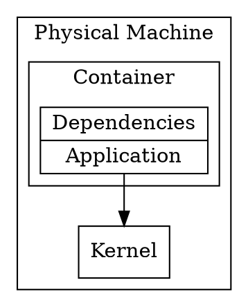
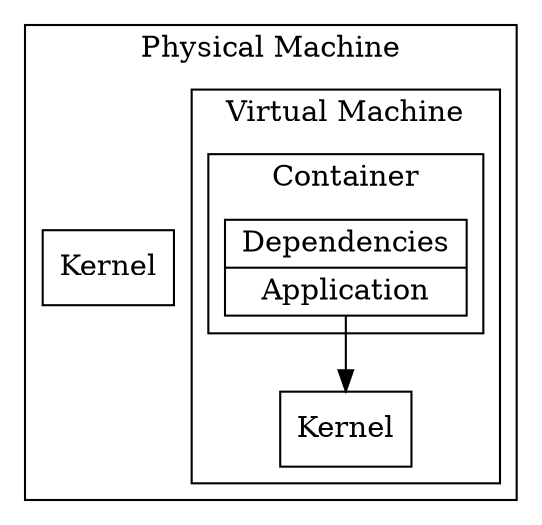

# Containerization

*Containerization* or OS-level virtualization, according to the
[Wikipedia](https://en.wikipedia.org/wiki/OS-level_virtualization):

> OS-level virtualization refers to an operating system paradigm in
> which the kernel allows the existence of multiple isolated user
> space instances.

And it continues:

> Such instances [...] may look like real computers from the point of
> view of programs running in them. A computer program running on an
> ordinary operating system can see all resources (connected devices,
> files and folders, network shares, CPU power, quantifiable hardware
> capabilities) of that computer. However, programs running inside of
> a container can only see the container's contents and devices
> assigned to the container.

In general, this is where Docker (formerly dotCloud) found a developer
focused niche. The UX Docker introduced allowed developers to:

* Define container images in a reproducible and in a very easy way
* Distribute these container images in a so-called registry
* Let developers run containers, based on container images:
  * Previously distributed to a shared registry
  * Locally built

As a result of this, it was much easier to reduce the friction and the
dependency between the application and the system it was running on,
because as with happens with virtual machine images, the container
image includes all operating system components, except for the kernel.

Still, the friction was not completely removed. Many containerized
applications expect environment variables, or certain volume mounting
to be set up, else they won't work as expected.

In any case, containerization and specially the UX dotCloud introduced
helped to make reproducible builds and environments easier with a greatly
reduced friction surface.

<table>
<tr>
<td>

</td>
<td>

</td>
</tr>
</table>
