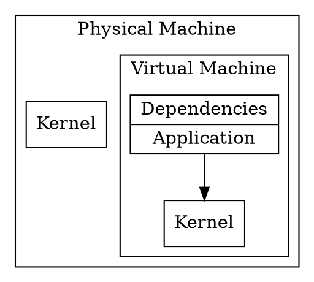
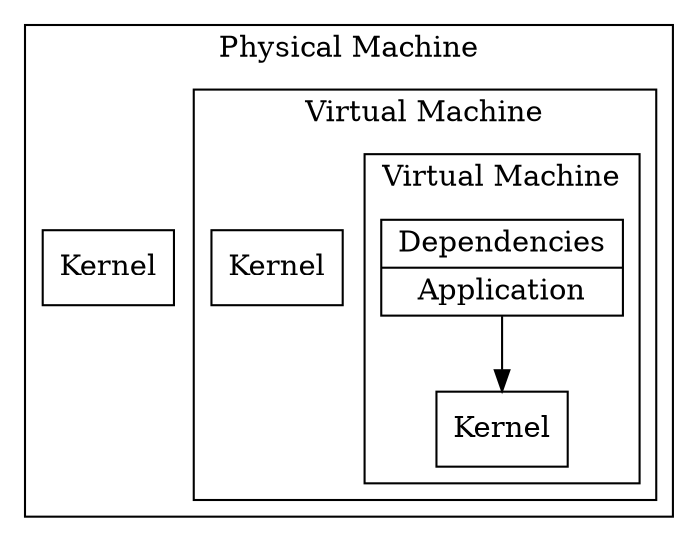

# Virtualization

A virtualized environment abstracts the concept of a physical machine,
running on top of a physical (or virtual) machine.

According to the
[Wikipedia](https://en.wikipedia.org/wiki/Virtualization),
*virtualization* is described as:

> *virtualization*: refers to the act of creating a virtual (rather than
> actual) version of something, including virtual computer hardware
> platforms, storage devices, and computer network resources.

When it comes to the deployment of applications, the strategy followed
for *metal* deployments can also apply on virtualized environments,
but other kind of deployments arised as well: start a machine from a
given template (or snapshot), including the application, or a mixed
approach in which certain components and pre-requisites come with the
template or snapshot, and some automation is used to deploy the
desired version of the application.

Since booting virtual machines is to all effects booting a machine
with a fully fledged operating system the startup time is still in the
orders of metal deployments.

<table>
<tr>
<td>

</td>
<td>

</td>
</tr>
</table>
