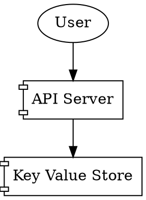
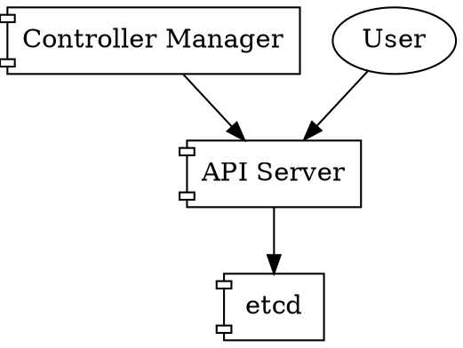
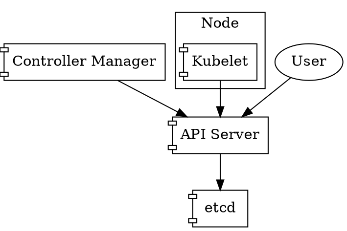
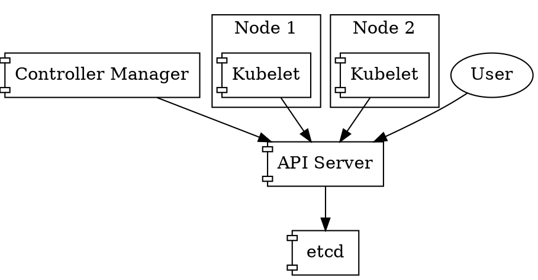
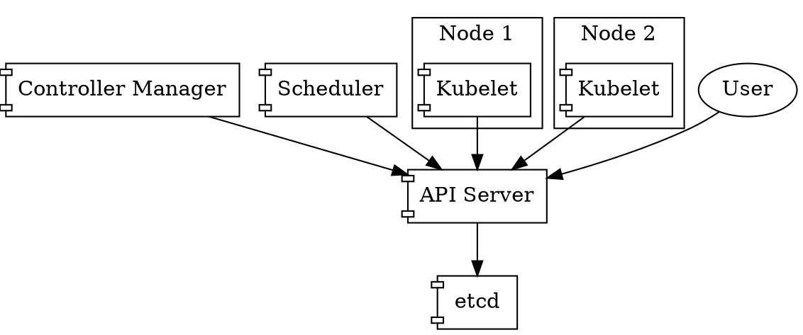
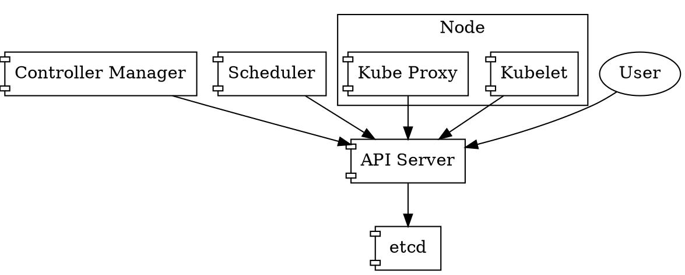
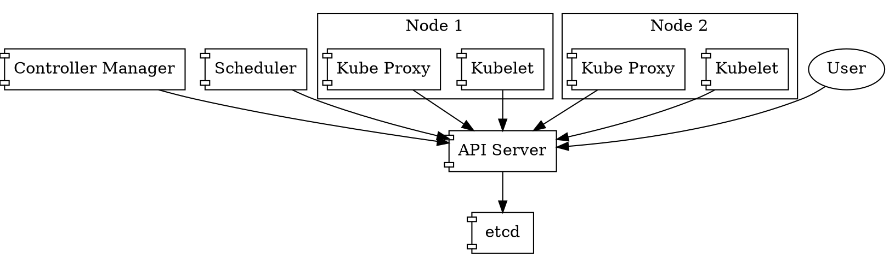

# Components

## The API Server

Let's start with a very simple overview, and build on top of that:

As users, we will use some kind of client to contact the API Server,
allowing us to *list*, *get*, *create*, *modify* or *delete*
resources.

These resources are stored by the *API Server* in some kind of
*Key Value Store*. The ubiquitous *Key Value Store* used for Kubernetes is
[*etcd*](https://etcd.io). However, and as we'll discover later, any
other backend implementing the *etcd* gRPC interface would work as
well (this is the idea behind [*Kine*](https://github.com/rancher/kine),
for example).

Now, we are able to create and manipulate resources. The *API Server*
will be the piece that will perform Authentication, Authorization, and
similar features for us, and will eventually store those resources
into *etcd*. However, we are missing the *reconciliation* part yet.

## The Controller Manager

For this, there is a component in Kubernetes called the *Controller
Manager*. The *Controller Manager* has a number of controllers that
can be opted-in, or opted-out. For the sake of simplicity, let's
assume that we use the default ones.

The *Controller Manager* is just another client, in that it connects
to the *API Server* in order to watch and manipulate resources.

Let's draw it.

Let's describe what the *Controller Manager* is, based on the [official
documentation](https://kubernetes.io/docs/reference/command-line-tools-reference/kube-controller-manager/):

> [...] is a daemon that embeds the core control loops shipped with
> Kubernetes. In applications of robotics and automation, a control
> loop is a non-terminating loop that regulates the state of the
> system. In Kubernetes, a controller is a control loop that watches
> the shared state of the cluster through the apiserver and makes
> changes attempting to move the current state towards the desired
> state.

Now, what is the *Controller Manager* reconciling exactly? We are
going to get a bit ahead of time here, but stay with me. Let me
describe two Kubernetes concepts, in the easiest possible way:

* *Pod*: is a group of one or more containers.
* *ReplicaSet*: set of replica *Pods*. Guarantees the availability of a
  specified number of identical *Pods*.

A *ReplicaSet* allows us to configure a *Pod* template inside it,
along with a number of replicas that we want running of that *Pod*.

As such, we as clients can directly create *Pods*, or we can create
*ReplicaSets*.

*ReplicaSets* will be *reconciled* by the *ReplicaSetController* (one
of the controllers bundled with the *Controller Manager*), and it will
in turn create as many *Pods* as required based on the number of
desired replicas.

> **Important**: by creating a *ReplicaSet*, the *ReplicaSetController*
> in the *Controller Manager* **reconciles** the current state (no *Pods*
> exist for this *Replica Set*), to a new state (desired number of *Pods*
> exist for this *Replica Set*), by creating the *Pods* itself against
> the *API Server*. **However**, *ReplicaSets* and *Pods* are just
> **resources** sitting on our *Key Value Store*; nothing is running yet.

## The Kubelet

The *Kubelet* is the Kubernetes node agent. It runs on every machine
that is part of our cluster, and is another *API Server* client.

Let's draw it.

Provided we have two nodes in our infrastructure capable of running
workloads, the diagram would look like this:

The *Kubelet* will then be yet another client of the *API Server*,
watching for *Pods* that are assigned to it, and again, *reconcile*
the **current** status (what pods are running right now on this machine?),
with the **desired** status (what pods should be running right now on
this machine?).

It will use a Container Runtime (such as Docker, cri-o or containerd),
in order to manage the containers defined in *Pods* (creating, or
deleting them).

Now, if we created a *Replica Set*, that resulted in *Pods* being
created by the *ReplicaSetController*, how do these *Pods* get
**scheduled** on any of the nodes, so the *Kubelet* on that node can
then **reconcile** and create the real workloads?

## The Scheduler

As you can imagine, its job is to *schedule* workloads. Let's get more
into detail: the *Scheduler* is watching the *API Server* for *Pods*
that are **unscheduled**, and will assign a node for each *Pod*, based
on specific decision algorithms, also taking into account specific
user-provided preferences for those workloads.

Let's draw it.

And so, again, the *Scheduler* is just another *API Server* client.

## The Proxy

The Kubernetes Proxy (or *kube-proxy*) is yet another Kubernetes
component running on all nodes of the cluster. Its main duty is to
install networking rules on the host, so pods can reach internal
service IP addresses.

Let's draw it.

The Kubernetes Proxy usually runs in a containerized fashion, but that
is not relevant for the purpose of this diagrams. Let's draw it with
two nodes again:

Some CNI providers have enabled the ability to not depend on the
Kubernetes Proxy, such as [cilium](https://cilium.io).
