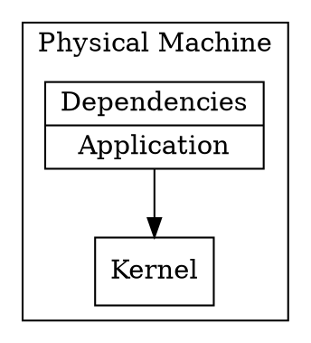

# Metal

Deploying on the metal is the strategy of deploying an application
directly on top of the operating system that is running on a given
physical machine.

Assuming we have a physical server with an operating system running,
performing the deployment on this environment means running a number
of steps in order for the operating system to spawn a new process that
runs our server.

