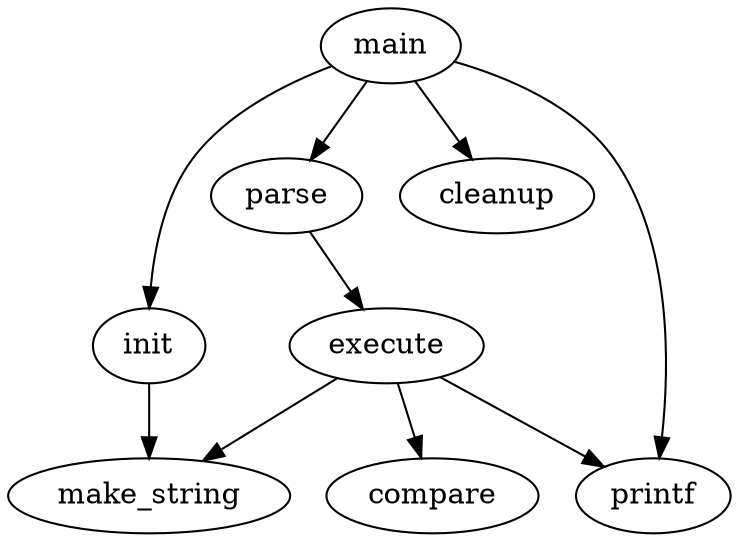
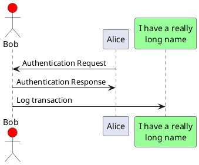
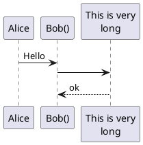

# Welcome

```dot process Named Graph
digraph G {
  main -> parse -> execute;
  main -> init;
  main -> cleanup;
  execute -> make_string;
  execute -> printf
  init -> make_string;
  main -> printf;
  execute -> compare;
}
```

```plantuml
@startuml
actor Bob #red
' The only difference between actor
'and participant is the drawing
participant Alice
participant "I have a really\nlong name" as L #99FF99
/' You can also declare:
   participant L as "I have a really\nlong name"  #99FF99
  '/

Alice->Bob: Authentication Request
Bob->Alice: Authentication Response
Bob->L: Log transaction
@enduml
```

```plantuml
@startuml
Alice -> "Bob()" : Hello
"Bob()" -> "This is very\nlong" as Long
' You can also declare:
' "Bob()" -> Long as "This is very\nlong"
Long --> "Bob()" : ok
@enduml
```
